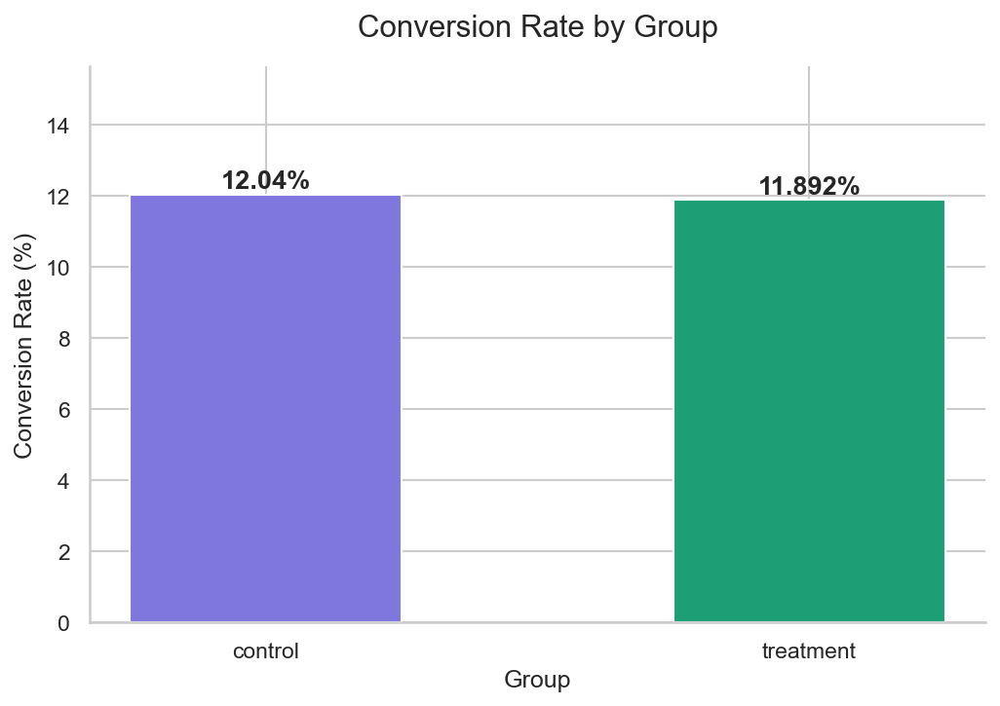
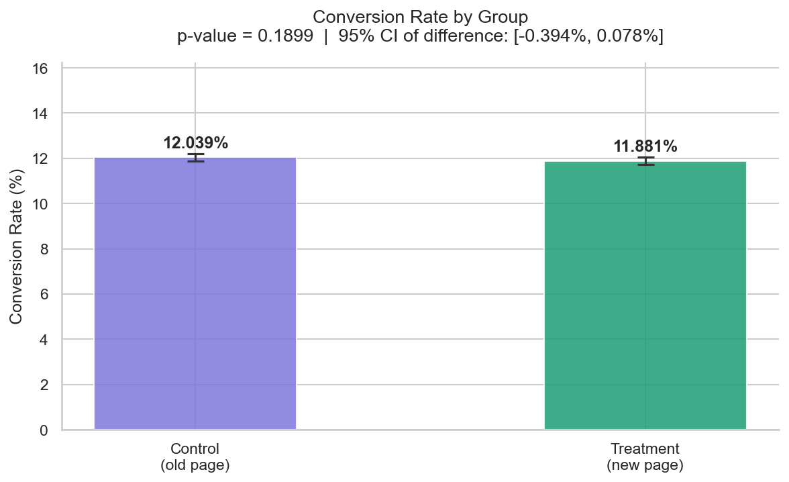

# A/B Testing & Ad Hoc Analysis Portfolio

A end-to-end data analysis project demonstrating skills in exploratory 
data analysis, data quality investigation, and statistical A/B testing 
using a real-world e-commerce dataset.

---

## The Business Question

> *"We redesigned our landing page. Should we ship it?"*

A company ran an experiment showing 290,000+ users either the original 
page (control) or a redesigned page (treatment), tracking whether each 
user converted (made a purchase). This project analyses that experiment 
from raw data through to a final business recommendation.

---

## Key Findings

| Metric | Control | Treatment |
|---|---|---|
| Users | 145,274 | 145,310 |
| Conversion rate | 12.039% | 11.881% |
| Difference | — | -0.158% |
| P-value | — | 0.1899 |
| Significant? | — | ❌ No |

**Recommendation: Do not ship the new page.** The observed difference 
is not statistically significant (p = 0.1899 > α = 0.05). The new design 
shows no meaningful improvement over the original.

---

## Project Structure

ab_testing_portfolio/
├── data/
│   ├── raw/               ← original dataset (not tracked by Git)
│   └── processed/         ← cleaned dataset produced by notebook 01
├── notebooks/
│   ├── 01_exploratory_analysis.ipynb   ← EDA & data quality checks
│   └── 02_ab_test.ipynb                ← statistical A/B test
├── reports/
│   ├── conversion_rate_by_group.png    ← EDA chart
│   └── ab_test_result.png             ← test result chart
├── requirements.txt
└── README.md

---

## Notebooks

### 📒 01 — Exploratory Analysis
[`notebooks/01_exploratory_analysis.ipynb`](notebooks/01_exploratory_analysis.ipynb)

- Loaded and inspected 294,478 rows of raw experiment data
- Identified **3,893 mismatched rows** — users assigned to one group 
  but shown the wrong page (1.32% of dataset)
- Found and removed **1 duplicate user**
- Visualised conversion rates by group
- Saved cleaned dataset to `data/processed/`

### 📒 02 — A/B Test
[`notebooks/02_ab_test.ipynb`](notebooks/02_ab_test.ipynb)

- Defined null and alternative hypotheses before running any test
- Ran power analysis to confirm sample size was sufficient
- Ran a two-proportion z-test
- Calculated 95% confidence interval on the difference
- Delivered a plain-English business recommendation

---

## Charts

**Conversion rate by group (EDA)**



**A/B test result with confidence intervals**



---

## How to Run

```bash
# Clone the repo
git clone https://github.com/ughitsashwin/ab-testing-portfolio.git
cd ab-testing-portfolio

# Create and activate virtual environment
python3 -m venv venv
source venv/bin/activate

# Install dependencies
pip install -r requirements.txt
```

Then download the dataset from Kaggle:
👉 https://www.kaggle.com/datasets/zhangluyuan/ab-testing

Place `ab_data.csv` in `data/raw/` and open the notebooks in order.

---

## Tech Stack


---

## Skills Demonstrated

- **Ad hoc analysis** — open-ended data investigation without a 
  predefined script, identifying data quality issues independently
- **Data cleaning** — principled removal of contaminated records 
  with clear reasoning and audit trail
- **Statistical testing** — hypothesis definition, power analysis, 
  z-test, p-value interpretation, confidence intervals
- **Communication** — translating statistical results into a clear 
  business recommendation a non-technical stakeholder can act on

---

*Dataset source: [Kaggle — A/B Testing by Zhangluyuan]
(https://www.kaggle.com/datasets/zhangluyuan/ab-testing)*